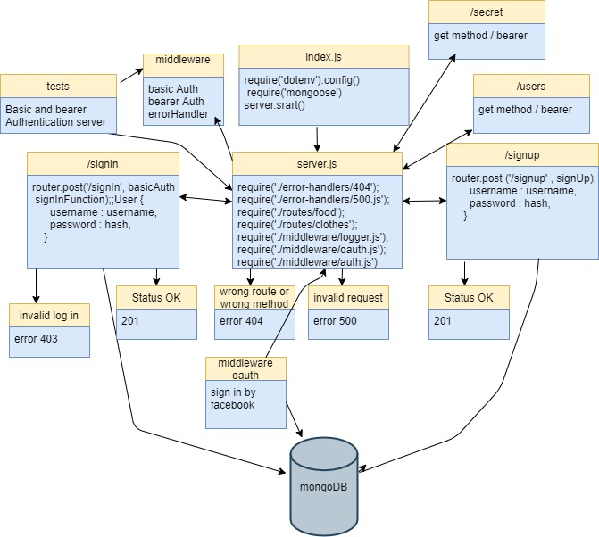

# OAuth-Facebook

Authentication Server : Facebook login OAuth 

**Author:** Nour Abu El-Enein

**Links:**

- [Repo Link](https://github.com/engnour94/OAuth-Facebook)
- [Deployed Site](https://fb-outh-by-nour.herokuapp.com/)

## Setup

### Install

- Clone the repository from GitHub
- Run the command `npm i express dotenv morgan base-64 bcrypt cors mongoose jsonwebtoken jest @code-fellows/supergoose` to install dependencies
- create .env file with PORT variable and `MONGODB_URI=mongodb:******` and a secret key `SECRET=****`

### Running the app
`npm run start`

### Endpoints:

* git `/oauth` ---> 'oauth' -->

* post `/signin` ---> 'Basic Auth'

* post `/signup` ---> 'No Auth '

* let `/users` ----> bearer

* get `/secret` ----> bearer

* CRUD `/api/v1/model` ---> Oauth

* CRUD `/api/v2/model` ---> Oauth

 ### Returns Object

 Returns a JSON object with the generated token and the username
  {
"token": " ********* ",
"user": "user name"
}

## Documentation

### UML Diagram

